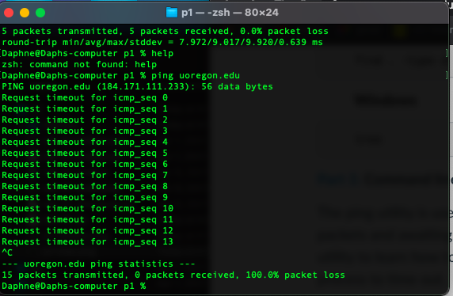
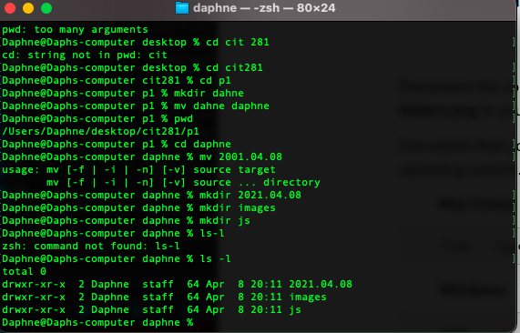
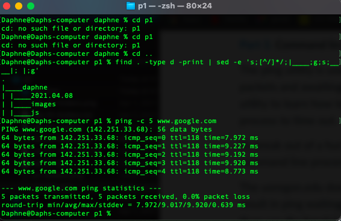
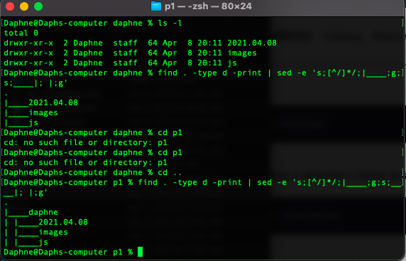

## Project 1
Purpose of the project:

Gain experience accessing your operating system's command line interface (CLI)

Gain experience working with CLI commands

Gain experience working with Visual Studio Code (VSCode)

Gain experience writing and executing non-web server Node.js JavaScript code

Technologies used for the project:

Terminal/Command Line Interface, Visual Studio Code, Node.js 

What I learned from the project:

From this project I was reintroduced with many javacscript tools that would be very useful for the entire term, and solidified my knowledge gained from lab 1 about command line interface use. 

